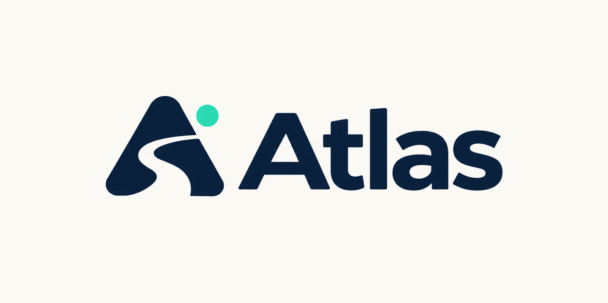

# Atlas

[](https://github.com/atos-og/atlas-travel/actions/workflows/tests.yml)



**A personal travel assistant.**

A conversational travel assistant built as a public portfolio project. The current private prototype uses Python, the official WhatsApp Cloud API, persistent conversations, and experimental flight search. The public product name is simply **Atlas**; see the [naming system](docs/NAMING.md) and [visual identity](docs/VISUAL_IDENTITY.md).

## Features

- Guided round-trip searches with explicit airports, dates, and 1–6 adults.
- Combined trip requests and explicit corrections that preserve unrelated details.
- Search progress notices and contextual price-objection clarification.
- Explicitly saved origin, adult count, and search preference, with view/reuse/delete commands.
- Opt-in nearby-date comparisons: at most three date pairs, shifting both legs by ±1 day.
- Supported Portuguese date expressions, such as `dia 23 de outubro desse ano` (October 23 this year), `amanhã` (tomorrow), and `7 dias depois` (seven days after departure).
- Native passenger, preference, and offer lists; confirmation buttons; an **Open offer** URL button, currently labeled `Abrir oferta` in the Portuguese conversation.
- Ranking by lowest price, shortest duration, nonstop service, or highest price among returned offers.
- An optional total budget in BRL for all adults and both directions, adjustable after a search.
- Up to four displayed offers with round-trip totals, local times, airlines, durations, and Google Flights links when valid data is available.
- A guided one-way bus flow with price, duration, connection, declared-class, and total-budget ranking; its ClickBus partner source remains disabled until credentials are approved.
- Signed webhooks, an allowlisted recipient, a SQLite queue, deduplication, and delivery-status tracking.
- Sourced sightseeing drafts for São Paulo and Bogotá: 1–3 days, culture/nature, pace, edits, exclusions, and preserved flight searches.
- A native capability menu plus contextual post-search suggestions that make nearby dates, sightseeing, and destination comparison discoverable.
- Budget-led comparison of up to three chosen destination airports, with exact dates, separate query outcomes, and explicit selection.
- Optional Groq-hosted natural-language interpretation that maps varied Portuguese wording to an allowlisted Atlas action or the current guided answer, including flight, itinerary, and destination-comparison steps.
- Controlled answers for natural questions about saved offers, baggage, buying, price freshness, privacy, buses, alerts, product coverage, and comfort limits.
- A saved-trip summary and a domestic/international preparation checklist, available from the native menu or natural requests.
- Thirty-day local retention by default, rotating integrity-checked SQLite snapshots, aggregate status output, and separate liveness/readiness endpoints.

**Experimental data source:** live CNF–GRU searches succeeded for one and two adults, producing ranked results and links. Earlier searches returned no results, so availability remains uncertain. Checkout prices and purchases have not been validated. See the [live validation record](docs/LIVE_VALIDATION.md).

Live bus-source activation, cross-mode comparison, broader itinerary coverage, whole-month date searches, and alerts are future milestones. Deterministic Portuguese parsing remains the fallback. When explicitly enabled, a Groq-hosted open-weight model translates the current message into a validated intent; it does not generate fares, links, itineraries, or final replies. Ambiguous dates require clarification. Sightseeing uses a small editorial catalog with official source links, not live opening-hours or ticket-availability verification.

## Technology stack

| Layer | Technology | Role in Atlas |
| --- | --- | --- |
| Application | Python 3.12+ | Conversation state, validation, provider orchestration, and webhook worker |
| Messaging | WhatsApp Cloud API and Meta Graph API | Inbound webhooks, native controls, delivery status, and outbound messages |
| Language model | OpenAI GPT-OSS 20B (`openai/gpt-oss-20b`) | Bounded intent and current-step answer interpretation |
| Model runtime | GroqCloud API | Hosted inference for GPT-OSS 20B; the private prototype uses Groq's free tier |
| Deterministic NLU | Atlas local Portuguese parser | First-line parsing and fallback when hosted interpretation is unnecessary or unavailable |
| Travel source | Google Flights through a pinned `fli` revision | Experimental round-trip fare discovery and links |
| Bus source | ClickBus partner API adapter | Implemented behind a disabled credential gate; no live-fare claim |
| Storage | SQLite | Inbox, sessions, preferences, delivery state, and fare snapshots |
| Development ingress | Cloudflare Quick Tunnel | Temporary HTTPS access to the local webhook |
| Packaging | Docker | Reproducible single-replica webhook image with an unprivileged runtime user |
| Quality | `unittest` and GitHub Actions | Local regression coverage and CI on every push |

GPT-OSS 20B is published by OpenAI as an open-weight model and is executed for Atlas by GroqCloud. Atlas does not call OpenAI's hosted API, and a ChatGPT subscription is unrelated to this integration.

## Run locally

Python 3.12+ and Git are required. The offline simulator and unit tests have no third-party dependencies:

```sh
python -m atlas
python -m unittest discover -s tests -v
```

To run the webhook with the optional flight provider:

```powershell
python -m venv .venv
.venv\Scripts\python.exe -m pip install -r requirements.txt
Copy-Item .env.example .env
# Fill in the private settings described in the setup guide.
.venv\Scripts\python.exe -m atlas.webhook
```

The server listens on `127.0.0.1:8787`. Meta needs a publicly reachable HTTPS callback. Outbound replies and external searches are disabled by default. Follow the [WhatsApp setup guide](docs/WHATSAPP_SETUP.md).

For a hosted single-replica deployment, the webhook accepts a bounded `ATLAS_WEBHOOK_HOST` and either `ATLAS_WEBHOOK_PORT` or a platform-provided `PORT`. The included container runs as an unprivileged user and requires persistent storage at `/app/work`. See the [deployment boundary](docs/DEPLOYMENT.md).

For a zero-cost persistent local runtime, Docker Compose mounts the ignored `work/` directory from the host and restarts the container automatically:

```powershell
docker compose up --build --detach
docker compose ps
```

Natural-language interpretation is also disabled by default. Set `ATLAS_NLU_ENABLED=true`, provide `GROQ_API_KEY`, and optionally select `GROQ_MODEL`. See the [bounded interpretation design](docs/NATURAL_LANGUAGE.md). The provider's free tier has quotas and is not an uptime or permanent-pricing guarantee.

Example conversation, one message per step: `oi` → `Confins` → `Bogotá` → departure date → return date → `1` adult → `1` for lowest price → `sem limite` for no budget limit → `sim` to confirm. Alternatively, send `Confins para Guarulhos, ida 23/10/2027, volta 30/10/2027, dois adultos, mais barata, sem limite` as one message. The bot still requires confirmation before searching. Use future dates. Ambiguous places such as São Paulo or Colombia require a specific airport. `python -m atlas` remains an offline demonstration and does not query fares.

For read-only diagnostics, run `python -m atlas.check`; add `--meta` to test Meta access without sending messages, `--token` to inspect the Meta token lifetime, or `--groq` to send one synthetic intent request that validates the configured Groq key and model without using traveler data.

Additional safe operational commands:

```powershell
python -m atlas.maintenance status
python -m atlas.maintenance backup
python -m atlas.nlu_audit
python -m atlas.provider_audit CNF GRU 20/11/2026 27/11/2026 --adults 1
python -m atlas.profile
```

The model audit uses twelve fixed synthetic phrases. The provider audit prints counts, a price range, and link domains without exposing booking URLs. The profile check reports branding readiness without printing the phone number, token, or profile-picture URL.

When a temporary tunnel changes, synchronize its base URL with the existing Meta app subscription using `python -m atlas.callback https://example.trycloudflare.com`. The command adds `/webhook`, performs Meta's verification challenge, preserves the `messages` field, verifies the saved subscription, and prints no credentials. It does not generate or renew the WhatsApp access token.

Sightseeing also works in the offline simulator: send `roteiro para São Paulo`, `sem data`, `3 dias`, `misto`, `equilibrado`, then `montar`. Use `fontes do roteiro` for the sources and `voltar aos voos` to resume the flight flow. See [itinerary behavior and coverage](docs/ITINERARIES.md).

## Scope and limitations

The unofficial Google Flights provider may change or become unavailable. Atlas does not cover every source or guarantee the market's lowest price. Links open Google Flights, not an Atlas checkout. Baggage, refund rules, and comfort are not inferred from price. Only economy round trips for adults are supported.

The bus conversation is implemented for one-way trips and one to six adults, but live pricing is disabled until ClickBus partner access is granted. It does not scrape public booking pages, invent prices, or fabricate a checkout link. See [bus source scope and activation](docs/BUS_TRAVEL.md).

The initial setup is a private test without purchased services. This does not guarantee free WhatsApp production usage. The computer, tunnel, and server must remain running. The prototype is not ready for public customer service.

## Documentation

- [Version 1 acceptance and release gates](docs/V1_RELEASE.md)
- [Portfolio demonstration guide](docs/DEMO.md)
- [WhatsApp message formatting](docs/MESSAGE_STYLE.md)

- [Approved visual identity](docs/VISUAL_IDENTITY.md)
- [Brand and product brief — nontechnical](docs/BRAND_BRIEF.md)
- [Product plan and differentiators](docs/PLAN.md)
- [Architecture](docs/ARCHITECTURE.md)
- [Implementation and validation status](docs/STATUS.md)
- [Private prototype acceptance and remaining work](docs/ACCEPTANCE_CHECKLIST.md)
- [WhatsApp setup](docs/WHATSAPP_SETUP.md)
- [Deployment boundary and container](docs/DEPLOYMENT.md)
- [Optional zero-cost external hosting](docs/FREE_HOSTING.md)
- [Conversation behavior and native controls](docs/CONVERSATION.md)
- [Bounded natural-language interpretation](docs/NATURAL_LANGUAGE.md)
- [Sightseeing itinerary coverage, sources, and rules](docs/ITINERARIES.md)
- [Destination comparison by budget](docs/DESTINATION_DISCOVERY.md)
- [Bus travel source, flow, and activation](docs/BUS_TRAVEL.md)
- [Security](SECURITY.md)
- [Contribution and language policy](CONTRIBUTING.md)

Repository documentation is written in English. Quoted Portuguese phrases document the current user-facing conversation; they are not English-language input support claims.

Selected provider behavior was adapted from [Fly Club](https://github.com/atos-og/flyclub), also by Atos Barros. See [third-party notices](THIRD_PARTY_NOTICES.md). Licensed under MIT.
