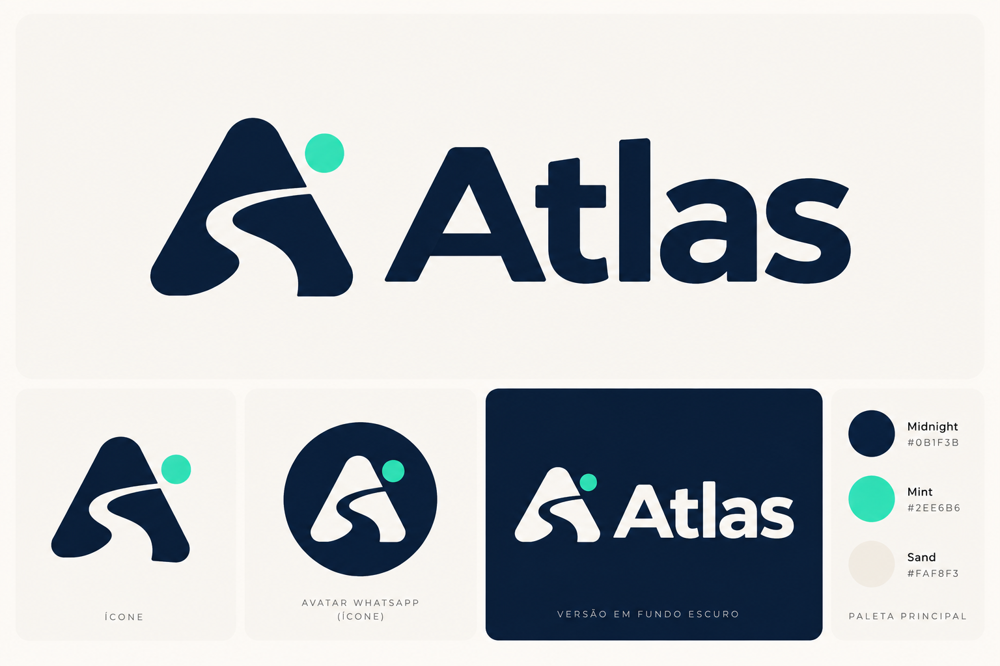

# Approved Atlas visual identity

Approved by the project owner on September 24, 2026. This direction replaces the earlier exploratory palette and symbol proposals in the brand brief.

## Source of truth

The supplied PNG is preserved unchanged in `assets/brand/atlas-identity-reference.png`. The Portuguese labels inside the owner-supplied artwork are preserved as part of that original image. Project documentation remains in English.

The mark is a rounded A silhouette with a winding route cut through it and a separate Mint circle. The Atlas wordmark is bold, with rounded forms. Its exact font is not identified by the source; do not claim or substitute an exact typeface without a matching original.

## Palette

| Name | Hex | Role |
| --- | --- | --- |
| Midnight | `#0B1F3B` | Primary artwork, text, dark backgrounds |
| Mint | `#2EE6B6` | Circular accent and small highlights |
| Sand | `#FAF8F3` | Light backgrounds and light artwork on dark surfaces |

Machine-readable values are stored in [tokens.json](../assets/brand/tokens.json). Use the labeled values rather than sampled raster shading. The previous coral accent and ocean-teal palette are superseded.

## Applications

- **WhatsApp profile:** standalone light symbol and Mint dot on Midnight, centered with enough margin for circular cropping. Avoid the full wordmark and small text at avatar size.
- **Cover and repository artwork:** horizontal symbol and Atlas wordmark, on Sand or in the approved reversed version on Midnight. Preserve the proportions and keep enough space around the composition.
- **Future offer cards:** keep fares, dates, stops, and actions readable. The brand supports the information; it does not replace it. Essential details must also be available as text.
- **Supporting text:** use clear lettering compatible with the reference. Supporting font selection and a tagline remain open decisions.

Do not recolor the Mint dot, stretch the mark, introduce unrelated travel symbols, or redesign the wordmark when adapting a layout. No new logo concept is needed.

## Asset readiness

The current source is a composite raster identity board. It is an approved reference, not a vector master or a set of separate production exports. Clean standalone avatar and cover exports are still needed; dimensions should match the actual destination surface. A production export should preserve the approved artwork and be reviewed at small sizes and under circular cropping.

Adding this reference to the repository does not update the WhatsApp account's profile image or publish a cover. Those account changes have not been performed by this documentation update.
