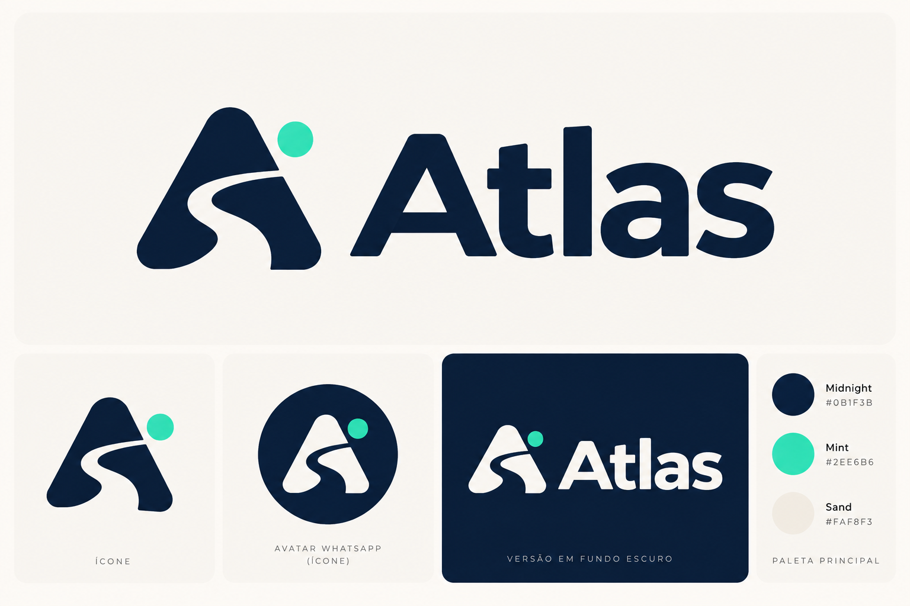

# Approved Atlas visual identity

Approved by the project owner on September 24, 2026. This direction replaces the earlier exploratory palette and symbol proposals in the brand brief.

## Source of truth

The supplied PNG is preserved unchanged in `assets/brand/atlas-identity-reference.png`. The Portuguese labels inside the owner-supplied artwork are preserved as part of that original image. Project documentation remains in English.

The mark is a rounded A silhouette with a winding route cut through it and a separate Mint circle. The Atlas wordmark is bold, with rounded forms. Its exact font is not identified by the source; do not claim or substitute an exact typeface without a matching original.

## Palette

| Name | Hex | Role |
| --- | --- | --- |
| Midnight | `#0B1F3B` | Primary artwork, text, dark backgrounds |
| Mint | `#2EE6B6` | Circular accent and small highlights |
| Sand | `#FAF8F3` | Light backgrounds and light artwork on dark surfaces |

Machine-readable values are stored in [tokens.json](../assets/brand/tokens.json). Use the labeled values rather than sampled raster shading. The previous coral accent and ocean-teal palette are superseded.

## Applications

- **WhatsApp profile:** use [`atlas-whatsapp-avatar.png`](../assets/brand/atlas-whatsapp-avatar.png), which keeps the light symbol and Mint dot centered on Midnight with enough margin for circular cropping. Avoid the full wordmark and small text at avatar size.
- **Cover and repository artwork:** horizontal symbol and Atlas wordmark, on Sand or in the approved reversed version on Midnight. Preserve the proportions and keep enough space around the composition.
- **Future offer cards:** keep fares, dates, stops, and actions readable. The brand supports the information; it does not replace it. Essential details must also be available as text.
- **Supporting text:** use clear lettering compatible with the reference. Supporting font selection and a tagline remain open decisions.

Do not recolor the Mint dot, stretch the mark, introduce unrelated travel symbols, or redesign the wordmark when adapting a layout. No new logo concept is needed.

## Asset readiness

The approved composite raster identity board remains the source reference. A standalone square WhatsApp avatar is available at `assets/brand/atlas-whatsapp-avatar.png` and has been reviewed at small sizes and under circular cropping. A clean cover export and vector master are still needed.

The avatar was applied to the Meta-provided test number on September 27, 2026 and confirmed through the WhatsApp Business Profile API. Meta still exposes that sender as `Test Number`; a branded `Atlas` display name requires a production business phone number and Meta's display-name process.
